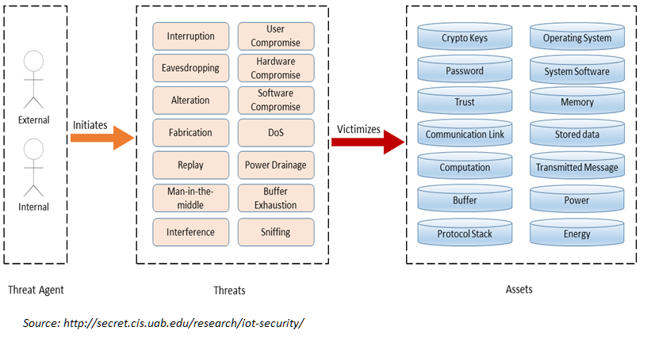

# Threat Models

This section is not about teaching you how to model you specific
security solutions. By now you know that your model should be
built out of attack vectors, security personas and security principles and requirements. The next chapter of this reference
architecture deals with reusable principles in depth. First we present
valuable models that can be reused when creating a security solution architecture.

Security threat modelling, or threat modelling, is a process of
assessing and documenting a system's security risks. Security threat
modelling enables you to understand a system's threat profile by
examining it through the eyes of your potential attackers. Your security
threat modelling efforts also enable your team to justify security
features within a system, or security practices for using the system, to
protect your corporate assets.

Many ways exist to build a threat model but in essence a threat model is
a conceptual model that:

-   helps to understand a situation and
-   is helpful in reducing security concerns. So helpful in
    solving your security problem.

A security threat model is built of relevant elements and their relations that matter in a security problem
situation.

In general, a conceptual model is constructed based on a specific
problem situation you want to solve. 

Real-world problems of security are outlined in a
large number of publications, within this section we only present
conceptual models that are based on the following selection criteria:

-   Generic use;
-   Non-commercial;
-   Open.

With open we mean that the institute or company created the model has an
open process that allows everyone to improve the model. Of course open
is not always really open without borders and thresholds. Even the open
group is not really open for public participation, since large
membership fees form a threshold. The OWASP foundation is however one
of the best examples on how open should be. That is open license on
content (common creative) and no impediments and no requirements for
participants who want to join the working groups.

For security many models exist. Most models are aimed for
evaluating risks for auditors and other stakeholders. In the sections
below a collection of (almost open) security thread models.

Starting thread modelling can be hard. So this playbook offers:
1. Collection of good thread models. You can use and reuse these within your own context. See the sections in this chapter.
2. Methods for performing threat modeling. See the subsections.

Methods for performing threat modelling are:

```{tableofcontents}
```


## OAuth 2.0 Threat Model

Using the OAuth protocol gives you many advantages. And since this
protocol is open you can save a lot of time when making use of the OAuth
Threat Model when using OAuth in your use case. A detailed description
of the thread model is found in RFC 6819
( http://tools.ietf.org/html/rfc6819 ).

In the picture below the visual of the threat model, where the numbers
are references to the section in the IETF RFC.


OAuth 2.0 basic model. 

## DDoS model

DDoS attacks are hard to prevent. However, every security or privacy
architecture should take DDoS attacks into account. This to design
solutions that are more resistant against the easy DDoS attacks. 

Problems due to DDoS Attacks: - DDoS attack is an attempt to make a
systems inaccessible to its legitimate users. - The bandwidth of the
Internet and a LAN may be consumed unwontedly by DDoS, by which not only
the intended computer, but also the entire network suffers. - Slow
network performance (opening files or accessing web sites) due to DDoS
attacks. - Unavailability and inability to access a particular web site
due to DDoS attacks.

The model below gives a DDoS attack taxonomy. This can be  useful if you
are designing solutions to be more resilient against DDoS attacks.


[Reference link](https://file.scirp.org/Html/5-7800164_34631.htm)()

## Mobile Threat model

Since mobile is everywhere, you should always take mobile threats
serious in your solution architecture. Even if you think you have a
special gateway for mobile traffic, most devices are always vulnerable
for mobile threads.

The model presented here below can help in identifying the threads.


## IoT Threat Model

We should be happy: The IoT (Internet of Things) is not everywhere
present yet. When IoT is migrated from fiction to reality, security and
privacy will be under enormous risks.

Internet-of-Things is a result of a technical revolution, which reflects
with future computing and communications including existing and evolving
internet. Over the time Internet technologies have evolved, and become
Internet of Things. With the advent of this paradigm the dream to
convergence everything, and everyone under a single umbrella has come
true. Machine-to-machine (M2M), Radio Frequency Identification (RFID),
context-aware computing, wearables, ubiquitous computing, and
web-of-things all are considered to be seamlessly integrated into a
global information network, which has the self configuring capabilities
based on standard and interoperable communication protocols .

Below a generic threat model for the IoT world:



Note the view is not complete. Missing these views are:

-   IDS, pentest tools, correlation tools etc (or under system security)

This IoT thread model and views are good for addressing the following
areas in more detail in your security solution:

-   Confidentiality
-   Integrity
-   Availability
-   User Management
-   Network Security
-   Key Management
-   Security Management
-   Governance
-   Risk
-   Regulation
-   Audit
-   Access Control
-   Standards for Interoperability

## Machine Learning Thread Model

Advances in machine learning (ML) in recent years have enabled a
dizzying array of applications such as data analytics, autonomous
systems, and security diagnostics. ML is now pervasive—new systems and
models are being deployed in every domain imaginable, leading to
widespread deployment of software based inference and decision making.

The attack surface of a system built with data and machine learning
depends on its purpose. Key threads for machine learning system can be
seen as:

-   Attacks which compromise confidentiality
-   Attacks which compromise integrity by manipulation of input.
-   'Traditional' attacks that have an impact on availability.

Attack vectors for machine learning systems can be categorised in:

-   Input manipulation
-   Data manipulation
-   Model manipulation
-   Input extraction
-   Data extraction
-   Model extraction
-   Environmental attacks (so the IT system used for hosting the machine
    learning algorithms and data)

Taxonomy and terminology of machine learning is not yet fully
standardised. The US NIST publication 8269 (The National Institute of
Standards and Technology) a taxonomy and terminology of Adversarial
Machine Learning is proposed. See
<https://csrc.nist.gov/publications/detail/nistir/8269/draft>.
Adversarial Machine Learning (AML)introduces additional security
challenges in training and testing (inference) phases of system
operations. AML is concerned with the design of ML algorithms that can
resist security challenges, the study of the capabilities of attackers,
and the understanding of attack consequences.

A simple outline of the basic components that must be incorporated in a
ML thread model is outlined below.


(Source: <https://berryvilleiml.com/interactive/> )

More information on specific aspects on machine learning can be found in
the [Free and Open Machine Learning Guide](https://nocomplexity.com/documents/fossml/abstract.html)

## ATLAS (Adversarial Threat Landscape for Artificial-Intelligence Systems)

 ATLAS (Adversarial Threat Landscape for Artificial-Intelligence Systems) is a globally accessible, living knowledge base of adversary tactics and techniques against Al-enabled systems based on real-world attack observations and realistic demonstrations from Al red teams and security groups. 

 Check and use [ATLAS](https://atlas.mitre.org/)

 Repository: [https://github.com/mitre-atlas](https://github.com/mitre-atlas)

 ATLAS is modeled after and complementary to MITRE ATT&CK®, raising awareness of the rapidly evolving vulnerabilities of Al-enabled systems as they extend beyond cyber. 
