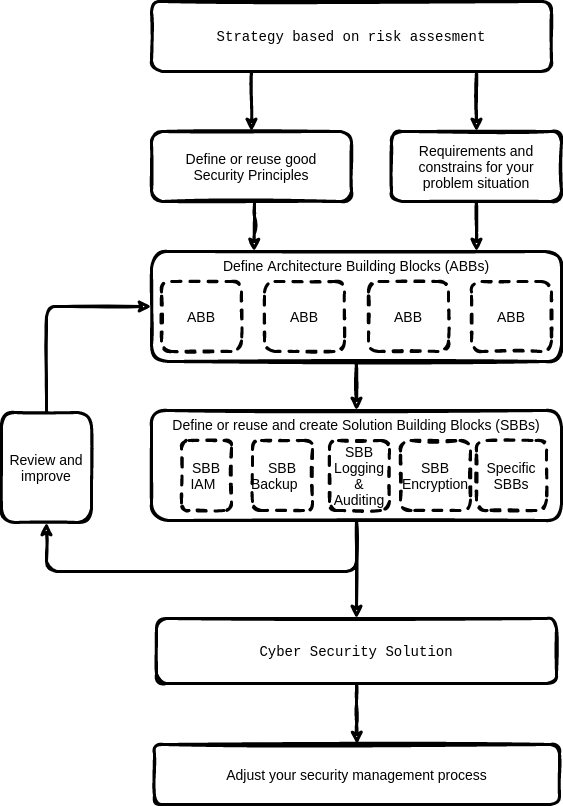

# Create a solution

This section outlines a clear and simple way to create your security solution.

To create a sustainable solution to mitigate security risks you must start is to create a security architecture for your solution. 

An architecture itself does not protect you but a good solution architecture:
* reduces costs
* time and
* lowers risks. 
In an architecture the emphasis is not only on the IT (software and hardware) but also on embedding the solutions into your organisation and processes.

The perfect solution to reduce security risks to zero does not exist. A solution architecture helps in the continuous process of optimizing and controlling your security risks.

Creating a security architecture can take a lot of time and effort. But a good way to speed up the process of creating your solution is to use this open security reference architecture as basis. 

This open security reference architecture is created to:
1. Make security architectures faster and
2. Improve the quality of your security solution.

## Simple steps

Creating security a security or privacy solution architecture consists of the following high level steps:

* Dive in the business strategy and organization. Perform a simple risks assessment.

*  Gather security  principles and requirements that are relevant for your context.

* Determine important constraints that apply to your security architecture. There are always constraints, e.g. time, budget, subject matter experts available etc.

* Derive the architecture building blocks from your architecture or design. Architecture building blocks help you to scope your solution. Using architecture building blocks gives a clear view on (new) integration aspects and where completely new solutions fit in the total IT landscape.

* Define or reuse the Solution Building Blocks needed to create the design. Prerequisite is that the functionality as specified in the Architecture Building Blocks  must be clear. 

* Review and improve your solution. 

## Risk Assessment

Many great open resources exist that guide you through the process of performing a risk assessment. Creating a risk matrix is not done every day. Use good documentation and proven tools. Make use of the many lessons learned in the field.

A number of good open resources that help you with your risk assessment are:
* [Risk Assessment Process Guide](https://www.digital.govt.nz/dmsdocument/3-risk-assessment-process-information-security/html) Based on ISO 3100:2009 Risk Management. Created by the New Zealand Government. Or use the also cc-by licensed [PDF version](https://www.digital.govt.nz/assets/Documents/3Risk-Assessment-Process-Information-Security.pdf). Of [download the MSWord template](https://www.digital.govt.nz/assets/Standards-guidance/Governance/Risk-Assessment-Process-Template.docx)

