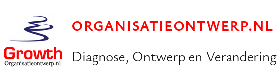

# Sponsors 

Our playbooks are, and always will be, free, without tracking or other breaches of your privacy.

This means that the website(s) where our Playbooks are published require no registration or membership and have no tracking or cookies. We advocate for openness and more awareness on digital privacy.

All content of our Playbooks can be used for free since it is licensed under a [Creative Commons license](https://creativecommons.org/licenses/by-sa/4.0/). So you are free to use, reuse and improve our Playbooks with attribution.

To make the development sustainable, we need users and companies, to support the development by providing their time and money.

Our content is free to read, but you can support us via a voluntary monthly subscription. We rely on ads and contributions to keep the lights on and expand our reach and impact. 

## Become a sponsor

As a free and open source project, you can sponsor our work to increase the audience for your commercial offerings.
We’ve got an audience of thousands of adopters that read and use our online Playbooks.

Please contact us by [using this page](https://nocomplexity.com/ads-and-sponsoring/) to discuss various options.

## Premium Sponsors

::::{grid} 2
:class-container: text-center
:gutter: 3

:::{grid-item-card} 
:link: https://nocomplexity.com/
:link-type: url

**Complexity is easy, but simplicity is truly valuable**
:::

:::{grid-item-card} 
:link: https://www.bm-support.org/
:link-type: url

 

**Openness by default to solve the most challenging problems!**
:::

:::{grid-item-card} 
:link: https://organisatieontwerp.nl/
:link-type: url

**Diagnosis, Design and Change**
:::

:::{grid-item-card} 
:link: https://nocomplexity.com/ads-and-sponsoring/

:::

::::

